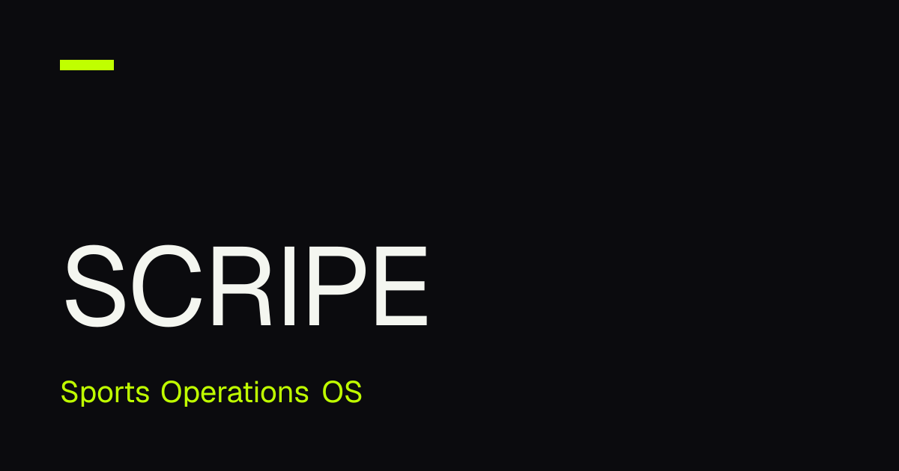
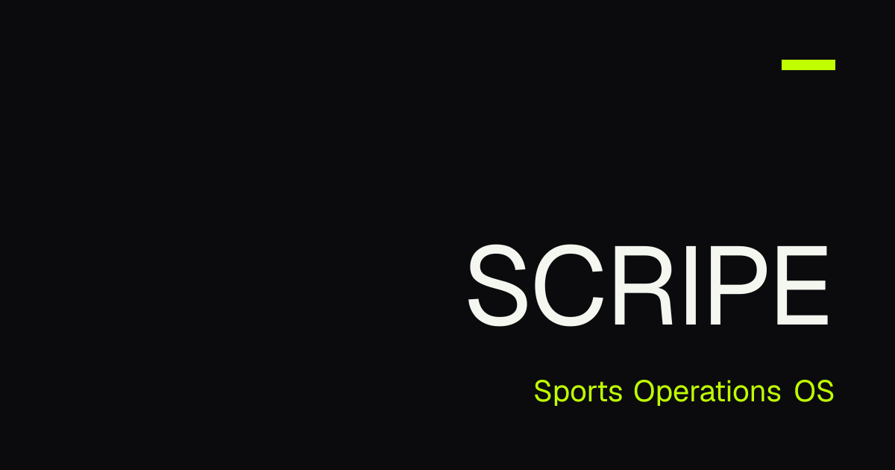

# SCRIPE Website Rebuild — Walkthrough

**Date:** 2026-08-18
**Branch:** `main` (this repo is the `SCRIPE-Website` submodule)
**Status:** Build green, 75/75 tests passing, all 22 page URLs statically prerendered. Two backend
connections and one DNS step are still open — see "What's left before launch" at the end.

This is the plain-language record of what the site rebuild delivered, what it costs in the
browser, how it was checked, and what's still outstanding. It's written for the person who has to
decide whether this is ready to point a domain at, not for the people who built it.

---

## 1. What shipped

The old static HTML site (`scripe-static/`) has been fully replaced by a Next.js application. It
is bilingual (English / Arabic, with proper right-to-left layout for Arabic — not a mirrored
CSS hack), dual-theme (light and dark, both hand-tuned, not one inverted from the other), and
every page is pre-built to static HTML at deploy time rather than rendered on request. There is no
database, no server-side session, and no third-party script anywhere on the site — everything a
visitor's browser loads comes from the site's own domain.

**12 page templates, each in English and Arabic (22 URLs total):**

| Page | What it is |
|---|---|
| **Home** | The flagship page — see the hero writeup below. Trust strip, the three-product family (Academy / Venue / Football Intelligence), a platform split-panel with a live-looking "operations board" evidence mock, the four-solution grid, a six-step automation story, a "many branches, one picture" convergence panel, and a closing call-to-action. |
| **Platform** | The full capability catalogue — 13 modules grouped into five product families behind a sticky in-page subnav, plus a consolidated evidence strip. |
| **Solutions hub** | Comparison grid across the four solution types, plus a plain compare panel (not a second grid). |
| **Solutions: Clubs / Academies / Venues / Multi-Sport** | Four pages sharing one template — hero snapshot, the real pain points, the capabilities that address them, outcomes, and cross-links to the other three. |
| **Pricing** | Plan cards, a monthly/annual billing toggle, a comparison table, FAQ, and live geo-detected currency conversion (see §4). |
| **Resources** | Guides, FAQ, a product-reading index, and articles — structured so a future MDX content pipeline can slot in without a rebuild. |
| **Company** | Mission, a "what we're building toward" checklist, four operating principles, and an honest legal/working-with-us notice. No invented team bios or history — none existed in the source site, so none were added here. |
| **Contact** | A real lead-capture form (name, email, organization, phone, type, message) with spam protection and a genuinely honest "not connected yet" state — see §7. |
| **404** | Localized, `noindex`, links back to home and the top pages. |

Every page carries correct per-locale metadata: title, canonical URL, `hreflang` alternates,
Open Graph / Twitter card tags, and structured data (Organization sitewide, breadcrumbs on every
page, software-application markup on the home page). This was verified by parsing the actual built
HTML, not by reading the source code that's supposed to produce it — see §6.

### The home page hero

This is the one genuinely cinematic piece of the site, so it's worth describing on its own. As you
scroll the home page, the hero doesn't just fade in — it plays out as a scroll-scrubbed camera
move over a night shot of a multi-sport campus (stadium, pool, training pitches, padel courts),
built from four separately delivered image plates (background, a stadium-and-pool midground
cutout, a foreground bokeh layer, and a top-down "living map" finale frame) that pan and scale at
different rates as you scroll, giving it real depth rather than a single flat image sliding around.
The camera path is scroll-position-driven, not autoplaying — nothing in the hero runs on a timer,
so there's no runaway animation to worry about and no pause button is needed for accessibility
compliance.

Two important things were built into this from the start, not bolted on after:

- **It degrades honestly.** If JavaScript hasn't loaded yet, if the visitor has "reduce motion"
  turned on, or if they're on a very old browser, the hero renders as a single static, fully
  composed frame with the same headline, both buttons, and the same five-chapter content strip
  underneath it — nobody loses content, they just don't get the camera move.
- **The buttons never disappear from keyboard/screen-reader users**, even mid-scroll while they're
  visually faded for the camera effect — this was a real bug caught in the accessibility audit
  (§6) and fixed before ship.

The four hero images currently shipped are lower-resolution than the target the camera move was
designed for (1915×821 delivered vs. a 3440×1476 target). The camera's zoom range was dialed back
about 15% to keep the image from looking soft at its most zoomed-in moment. When higher-resolution
versions of the same four images are dropped into `public/media/hero/` under the same filenames,
the zoom range can be dialed back up — no other code changes are needed. This is a known,
deliberate trade-off, not an oversight.

---

## 2. The stack

- **Next.js 16.3.1** (App Router, Turbopack), **React 19.2**, **TypeScript 5.9**.
- **next-intl 4.13** for the `/en` and `/ar` routing, with a proxy-level middleware that never sets
  a cookie on cacheable pages (so the static HTML stays cacheable at the edge).
- **Tailwind CSS v4**, driven entirely by a hand-authored design token system ("Fusion") — colors,
  type scale, spacing, motion timing, and z-index are all CSS custom properties with light and
  dark values authored independently (never one inverted from the other).
- **Motion:** CSS-first for everything (scroll-reveals, hover states, an animated progress rail),
  with GSAP + ScrollTrigger loaded only for the home page hero, only after the page has mounted,
  and never at all if the visitor prefers reduced motion — confirmed in the built output that GSAP
  never ships in the page's initial download.
- **Fonts:** four self-hosted variable fonts (Archivo, Inter, Noto Kufi Arabic, Noto Sans Arabic) —
  no Google Fonts, no CDN font loading.
- **Testing:** Node's built-in test runner (`node:test`) via `tsx` — 75 tests, all passing, covering
  routing, content-parity between the English and Arabic copy, structured-data builders, currency
  conversion math, lead-form validation, and metadata generation.
- **Hosting target:** static prerender for every route — the entire site can be served from a CDN
  edge with no origin server in the request path, except the two live-data integrations below.

---

## 3. Performance budgets

Measured directly from the production build output (`.next/`), gzip-compressed, on 2026-08-18.

| Budget | Target | Measured (worst case) | Margin |
|---|---|---|---|
| Framework floor (loaded on every route, unavoidable React + Next.js runtime) | ≤ 170 KB gz | 169.55 KB gz | 0.45 KB |
| — of which is actually downloaded by modern browsers* | — | **130.03 KB gz** | — |
| Total first-load JavaScript, worst route (home) | ≤ 220 KB gz | 198.56 KB gz | 21.4 KB |
| Page-specific JavaScript, worst route (home) | ≤ 50 KB gz | 29.0 KB gz | 21 KB |
| Third-party network requests, any route | zero | zero | — |

\* 39.5 KB of the "framework floor" is a legacy-browser polyfill bundle that ships marked
`nomodule` — every evergreen browser (current Chrome, Firefox, Safari, Edge) skips downloading it
entirely by the HTML spec's own rules. It's not paid for by the overwhelming majority of real
visitors; it's listed above for completeness, not because it's a live concern.

Every other page (platform, pricing, resources, company, solutions, contact) loads **less** JavaScript
than the home page — the home page's cinematic hero is the single heaviest thing on the site, and
it still lands comfortably inside budget.

No code changes were needed to hit these numbers — the budget audit (one of the dedicated QA
passes described below) found every route already passing with margin.

---

## 4. Quality process

The build was executed as 27 discrete, sequenced work packages (numbered 1 through 25.5, including
two packages added mid-project by explicit direction: a deprecated-API sweep and the hero-plate
integration once the images arrived). Every package that produced a code diff went through an
independent review before being considered done — not a self-check, a separate pass against the
actual diff. A handful of packages were audits rather than code changes (the bundle/performance
audit below is one — it made zero source edits) and produced no diff to review against; those were
instead verified by their own recorded evidence (measured numbers, gate results) rather than a
second reviewer's pass, and are called out as such in the ledger.

- **9 of the 27 packages** needed at least one round of fixes after review before they closed clean;
  **1 of those** needed a second round. Every fix round is recorded with what was found and what
  changed — nothing was waved through.
- **Every package's exit gate** was the same four commands, all required green before commit:
  `npm test`, `npm run typecheck`, `npm run lint`, `npm run build`.
- **Three dedicated, whole-site QA passes** ran after all 12 pages were built, each producing its
  own written report:
  - **Bundle & performance audit** — the numbers in §3. Found nothing that needed fixing.
  - **Accessibility, right-to-left, and reduced-motion audit** — swept every component. Found and
    fixed 8 real issues (a missing right-to-left arrow-flip rule that meant solution-page arrows
    didn't mirror in Arabic; a form-error region missing its screen-reader announcement role; a
    couple of hardcoded colors that should have been tokens; an anchor-link scroll offset
    mismatch; and a couple of unsafe type casts). Two items were checked and confirmed already
    correct (no runaway animations anywhere on the site; the hero's keyboard-focus reveal works
    correctly in both text directions).
  - **Content and SEO verification** — re-parsed the actual built HTML (not the source code) for
    every page: unique titles, canonical URLs, `hreflang` alternates, structured data, sitemap
    correctness, robots.txt environment gating. Found one real bug — the social-share preview
    image was silently missing from 20 of the 22 page URLs (only the home page had it) — root-caused
    to how Next.js merges per-page metadata, fixed in the one shared function every page's metadata
    already routes through, and locked in with 5 new tests so it can't silently regress again.

Final gate at time of writing: **75/75 tests pass, typecheck clean, lint clean, build clean, all 22
routes statically prerendered.**

---

## 5. Open items

| Item | Status | What it means |
|---|---|---|
| Live pricing currency conversion needs backend CORS | **Waiting on backend** | The pricing page already calls a live currency-detection endpoint and converts prices for the visitor's country. That endpoint needs to allow requests from `www.scripe.org` on the backend side — until it does, or if it's ever briefly down, the page quietly falls back to the baked-in Saudi Riyal prices. Nobody sees an error either way. |
| Contact form lead delivery | **Waiting on backend** | The form validates every field, blocks spam (a hidden honeypot field plus a minimum-time-on-page check), and is fully wired end to end — it just has nowhere to deliver a real lead yet. Until a `LEADS_ENDPOINT` is configured, a submitted form shows an honest "we're not connected yet, please email us directly" message instead of a fake success. |
| DNS / domain go-live | **Not started** | `www.scripe.org` isn't pointed at this build yet. Needs the Vercel project created, the domain attached, and an apex (`scripe.org`) → `www` redirect configured at the domain level. |
| Arabic social-share image | **Known limitation, two fixes identified** | See §6 below — full detail with both candidate fixes. |
| Hero images are below target resolution | **Working as designed, upgrade path ready** | Covered in §1 — drop-in replacement, no code change needed when higher-res versions exist. |
| A handful of small polish items | **Deferred, tracked** | See §8 — none of these affect correctness, security, or what a visitor experiences; they're the kind of thing that gets picked up opportunistically. |

None of these block a soft launch. The CORS and leads-endpoint items are the two genuinely
"needs someone on the backend to do something" blockers; DNS is an ops task; everything else is
cosmetic or deferred by design.

---

## 6. OG (social-share) image QA

One 1200×630 preview image is generated per locale (English, Arabic) — not per page. It's a
site-wide image (`src/app/[locale]/opengraph-image.tsx`, prerendered at build time for both
locales), and every page under that locale shares the same generated file for link previews on
social platforms, messaging apps, and Slack/Discord-style unfurls. Both locale variants were
extracted from the production build and inspected directly.

**English — correct, as designed:**

**Arabic — mirrored layout, but the tagline text is still in English:**

The Arabic image correctly **mirrors the whole layout** for right-to-left reading (the accent bar
moves to the top-right, the wordmark and tagline right-align) — it does not look like a broken or
untranslated English image at a glance. What it does not do is show the actual Arabic tagline text.

**Why:** the image-generation engine Next.js uses for these previews (a library called Satori) has
a hard limitation rendering Arabic script — it throws an internal error whenever it detects
Arabic-script text, independent of which font is used, and the failure isn't even fully consistent
(the same text sometimes renders and sometimes crashes). This was confirmed directly, not assumed:
shipping a genuinely broken image (or one that fails unpredictably at build time) was judged worse
than shipping a mirrored-layout image with English text, so that's the interim state — documented
in the code with a note to revisit.

**Two candidate fixes, either of which closes this cleanly:**

1. **Ship a pre-made Arabic image as a static file.** Instead of generating the Arabic preview
   image programmatically, have it generated once (through the same tool used for the hero
   plates) and drop it in as a static asset. This sidesteps the rendering engine's limitation
   entirely and can happen any time — it doesn't need a framework fix.
2. **Wait for the rendering engine to support Arabic shaping**, or find a specific font file that
   avoids the unsupported code path, and switch the existing generator over. This is the "proper"
   fix but is blocked on a third-party library capability, not something under this team's control
   on a timeline.

Recommendation: option 1 is the practical near-term fix and can be done independently of any other
work whenever there's a few minutes to generate and drop in one image.

---

## 7. Live integrations

Two features call out to a live backend rather than being fully static:

- **Geo-priced pricing** (`/pricing`): detects the visitor's country server-side (via a
  Cloudflare header the backend reads — never a value the browser can spoof) and shows prices
  converted to their local currency, with a manual currency picker as an override. If the
  detection call fails or is blocked for any reason, the page shows the baked-in Saudi Riyal
  prices with zero layout shift — there's no broken or blank state.
- **Contact form submission** (`/contact`): validates and spam-filters every submission client-
  and server-side, then posts to a configurable `LEADS_ENDPOINT`. Left unset, the form still does
  everything except the final delivery and says so honestly.

Both are described in more detail in §5's open items.

---

## 8. Asset-gate registry

The project's rule for anything needing custom imagery: emit a precise, production-ready
generation prompt and stop that section rather than build around a placeholder. Over the whole
site, that rule was triggered exactly once.

| Asset | Status | Detail |
|---|---|---|
| Home hero — 4 cinematic plates (background, midground stadium/pool cutout, foreground bokeh, top-down finale) | **Delivered and integrated** | Generated from the written prompts in `docs/asset-briefs/hero-plates-2026-08-18.md`, verified, wired into the scroll-driven camera sequence. Currently 1915×821; a higher-resolution re-export is a drop-in replacement (§1). |
| Every other page (platform, solutions ×5, pricing, resources, company, contact) | **No custom imagery needed** | These pages are built typography- and data-led — capability grids, evidence panels, comparison tables — using the existing token system and UI components rather than photography. Nothing was blocked or built around a placeholder. |

A follow-on "Cinematic Elevation Wave" — giving individual sections their own bespoke art
direction beyond the home hero — has been scoped as a distinct future project, not started. It
would need its own go/no-go conversation before any work begins on it.

---

## 9. Deploy configuration (Vercel)

For whoever sets up the Vercel project:

- **Root directory:** repository root (this is a single Next.js app, not a monorepo with multiple
  deployable packages).
- **Environment variables:**

  | Variable | Required | Purpose |
  |---|---|---|
  | `SITE_URL` | Yes | `https://www.scripe.org` — used for canonical URLs, sitemap, and Open Graph tags. No trailing slash. |
  | `NEXT_PUBLIC_API_BASE_URL` | Yes | The SCRIPE backend's public API base (e.g. `https://api.scripe.org/api`) — used for the live pricing lookup. Public by design (ships to the browser). Also determines the `connect-src` origin in the CSP header (`next.config.ts`), so it must be set before the pricing feature can reach the backend in production. |
  | `NEXT_PUBLIC_APP_URL` | No (defaults to `https://app.scripe.org`) | The SCRIPE app's sign-in destination — read by `src/components/chrome/ia.ts` for the header/mobile-nav "Sign In" CTA link. Public by design (ships to the browser). |
  | `LEADS_ENDPOINT` | No (until backend ready) | Where contact-form submissions are POSTed. Server-only — never exposed to the browser. Leave unset and the contact form runs in its honest "not connected" mode described in §5/§7. |

- **Domain:** attach `www.scripe.org` as the production domain, and configure an apex
  (`scripe.org`) → `www` redirect at the Vercel domain level (not in application code).
- **Robots/indexing:** the site is deliberately `Disallow: /` everywhere except when the
  `VERCEL_ENV` environment variable equals exactly `production` (Vercel sets this automatically on
  the production deployment) — preview and local builds will never get indexed by accident.

---

## 10. Deferred polish (non-blocking)

None of the following affect correctness, security, or what a visitor sees or experiences today.
They're recorded so they aren't lost, not because they need immediate attention.

**Design-token debt**
- A handful of CTA panels (6 files) share a hardcoded dark border color that's intentionally the
  same in both light and dark theme (a deliberate "always obsidian" panel design) — closing this
  properly needs one new token added to the token file, which is currently owned by a parallel
  work session.
- Arabic content carries roughly 55 Eastern Arabic-Indic digit occurrences across
  `src/content/ar/{platform,home,solution-multi-sport}.ts`, concentrated in `platform.ts` (~40)
  and `home.ts` (~12). These are not stray mistakes — each file's own header documents a
  deliberate, disclosed rule: genuine dictionary-authored Arabic prose (e.g. "٩٧٪ مُسجَّل",
  "+٣٤٪ مقارنة بالموسم الماضي") keeps its original digits, while structured data slots (stat-strip
  values, KPI rows, board times) stay Western per the site's "Western numerals held constant"
  rule — this is a real, undisclosed-until-now tension between two rules that both exist in the
  codebase, not an oversight. `src/content/ar/company.ts`'s single flagged instance was already
  fixed by a separate session. `src/content/ar/contact.ts` and `src/content/ar/notFound.ts` each
  contain one Eastern-digit-looking match, but it's inside a doc comment citing the *opposite*
  rule as an example, not live content. The one confirmed structured-data violation found at
  final review — `solution-multi-sport.ts`'s "Group revenue" KPI rendering the same figure
  `platform.ts` already renders as "SAR 214K" — has been fixed to match. No further digit-policy
  cleanup is planned for this launch; the dictionary-prose exception is an accepted, documented
  convention, not open debt.

**Accessibility polish**
- The mega-menu (Solutions dropdown) has a minor keyboard-navigation gap (Shift+Tab from the
  trigger doesn't close the open panel) and opens on mouse-hover even when it was already toggled
  closed by click — both pre-existing, both minor, both in a file currently owned by a parallel
  work session.
- Two pages (Pricing, Contact) have a minor heading-hierarchy skip before a user submits the form
  or scrolls past the plan cards — fixing it cleanly needs a small amount of new copy, which
  wasn't invented unilaterally per the project's "never invent copy" rule; flagged for a content
  decision rather than fixed blind.

**Test coverage gaps**
- The lead-submission server action's network/timeout/logging paths have no dedicated unit tests
  (the validation logic that matters most does).
- The hero's scroll-choreography code (`Hero.tsx` / `HeroDirector.tsx`) has no automated test
  coverage — it was verified by direct inspection of the built output instead.

**Housekeeping**
- The two large hero image files (background and finale plates, ~2.3 MB each as delivered) could
  be re-compressed to a smaller format without any visible quality loss — this affects repository
  and deploy size only, not what a visitor downloads (Next.js already serves compressed,
  correctly-sized versions to the browser).
- A CSS rule for right-to-left arrow mirroring is defined identically in three separate
  stylesheets instead of one shared place — works correctly today, just worth consolidating next
  time any of those three files is touched.

---

## What's left before launch

**Ready today:** every page, both languages, both themes, full SEO metadata, accessibility and
reduced-motion handling, and performance budgets all pass with margin.

**Needs someone else's action before it's fully live:**
1. Backend: allow the live-pricing endpoint to accept requests from `www.scripe.org`.
2. Backend: stand up (or point to) a real lead-intake endpoint and set `LEADS_ENDPOINT`.
3. Ops: attach the domain in Vercel and configure the apex → `www` redirect.
4. Content call: decide what to do about the Arabic social-share image (§6 has two ready-to-execute
   options) and the two minor heading gaps (§10) — neither blocks launch, both are quick once
   someone signs off on the copy/approach.

Everything else in this document is either already closed or explicitly non-blocking.
